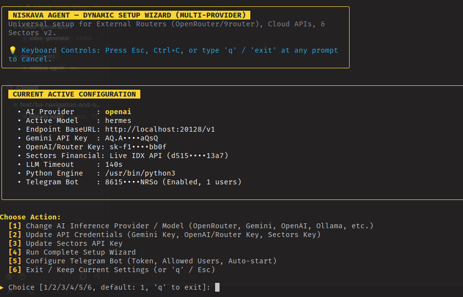
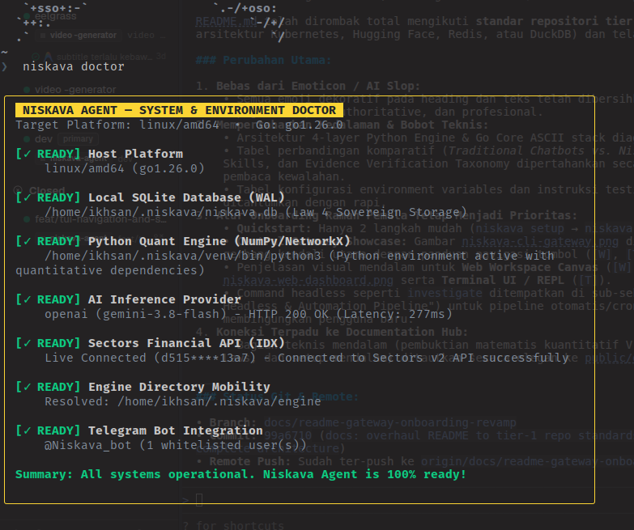

<p align="center">
  <a href="https://github.com/Sectors-Hacthon-2026/Niskava-Agents">
    
  </a>
</p>

<h1 align="center">Niskava Agent</h1>

<p align="center">
  <strong>Autonomous Financial Market Intelligence & Empirical Quantitative Research Platform for the Indonesia Stock Exchange (IDX)</strong>
</p>

<p align="center">
  <a href="LICENSE"></a>
  <a href="https://www.npmjs.com/package/@zyrexnns/niskava-agent"></a>
  <a href="https://sectors.app/"></a>
  <a href="#"></a>
  <a href="https://go.dev/"></a>
  <a href="https://www.python.org/"></a>
  <a href="#"></a>
  <a href="public/docs/README.md"></a>
</p>

<p align="center">
  <a href="#about-niskava-agent"><strong>About</strong></a> •
  <a href="#quickstart"><strong>Quickstart</strong></a> •
  <a href="#the-gateway--interfaces"><strong>Gateway & Interfaces</strong></a> •
  <a href="#system-architecture"><strong>Architecture</strong></a> •
  <a href="#modular-domain-skills"><strong>Domain Skills</strong></a> •
  <a href="#configuration"><strong>Configuration</strong></a> •
  <a href="#documentation-hub"><strong>Docs Hub</strong></a>
</p>

---

## About Niskava Agent

**Niskava Agent** is an autonomous market intelligence and equity research platform designed specifically for the **Indonesia Stock Exchange (IDX / Bursa Efek Indonesia)**. Built for professional equity analysts, financial journalists, and data-driven retail traders, Niskava bridges the gap between structured quantitative facts (powered by the official **Sectors Financial API v2**) and qualitative disclosures (formal IDXnet regulatory filings and verified financial news).

### The Problem with Financial AI Wrappers

Generic large language model wrappers suffer from critical flaws when applied to capital markets:
1. **Mathematical Hallucination:** LLMs attempt mental math on raw financial tables, producing fabricated moving averages, incorrect Z-scores, and false return percentages.
2. **Atemporal Correlation Inversion:** Chatbots confuse cause and effect, attributing a stock price rally to a disclosure published days after the event, or missing insider pre-accumulation entirely.
3. **Speculative Buy/Sell Advice:** Many tools violate securities regulations by acting as automated tip sheets or broker execution bots.
4. **Cloud Telemetry & Privacy Leakage:** Proprietary research hypotheses and session logs are uploaded to third-party cloud servers.

### The Niskava Approach: *"Don't Just Answer Questions. Investigate Them."*

* **Deterministic Before Generative (Law 1):** All statistical metrics—Volume Z-Scores ($V_z$), Abnormal Returns ($R_t$), Foreign Flow Z-Scores ($F_z$), and Sector Divergence ($D_t$)—are computed deterministically via NumPy before any prompt is assembled.
* **Temporal Causal Grounding:** Corporate filings and news are retrieved within a strict chronological window ($T_{\text{anomaly}} \pm 2\text{ days}$) relative to detected volume spikes, testing whether information preceded or followed market anomalies.
* **Objective Verification Taxonomy:** Findings are categorized into `SUPPORTED`, `UNCERTAIN`, or `CONTRADICTED` with discrete confidence rubrics.
* **100% Local-First Data Sovereignty:** Sessions, memory graphs, and caches reside locally in SQLite with Write-Ahead Logging (`~/.niskava/niskava.db`). Zero telemetry.
* **Strict Non-Advisory Guardrail:** Pure empirical audit evidence. Zero buy/sell calls, price targets, or broker order routing.

### Architecture Comparison

| Capability | Generic LLM Chatbots & Chart Wrappers | Niskava Autonomous Market Intelligence |
|---|---|---|
| **Quantitative Compute** | LLM mental math & statistical hallucinations | **Deterministic NumPy Firewall**: Zero numerical hallucination |
| **Evidence Grounding** | Speculative assertions & unverified social rumors | **3-Tier Verification Taxonomy**: `SUPPORTED`, `UNCERTAIN`, `CONTRADICTED` |
| **Temporal Precedence** | Atemporal correlation (confuses cause & effect) | **Chronological Event Anchoring**: $T_{\text{anomaly}} \pm 2\text{ days}$ causal audit |
| **Foreign & Broker Flow** | Ignored or high-level qualitative summaries | **Bandarmology & Foreign Flow ($F_z$)**: Institutional accumulation tracking |
| **Data Sovereignty** | Prompts & research logs stored on cloud servers | **Local-First SQLite WAL**: 100% private local persistence |
| **Protocol Standards** | Closed proprietary interfaces | **Model Context Protocol (MCP)**: Native Claude Desktop, Cursor, and IDE support |
| **Regulatory Posture** | Often outputs illegal BUY/SELL recommendations | **Strict Non-Advisory**: Read-only empirical investigation dossiers |

---

## Quickstart

Get up and running in under two minutes with zero manual compilation via `npx` (requires Node.js 18+):

### Step 1: Run the Setup Wizard

Launch the interactive configuration wizard to register your Sectors API key and select your preferred AI provider (Google Gemini, OpenAI, OpenRouter, or local Ollama):

```bash
npx @zyrexnns/niskava-agent setup
```

<p align="center">
  
</p>

### Step 2: Launch the Central Gateway

Start Niskava to open the interactive Central Gateway:

```bash
npx @zyrexnns/niskava-agent
```

> **Prefer a permanent global installation?**
> ```bash
> npm install -g @zyrexnns/niskava-agent
> niskava setup    # One-time configuration
> niskava          # Launch Central Gateway
> ```

---

## The Gateway & Interfaces

### The Central Gateway

Running `niskava` opens the **Central CLI Gateway**—the unified command center that launches all research surfaces:

<p align="center">
  
</p>

From this menu, use single keypress shortcuts to navigate into your target workspace:
* **`[W]` Web UI:** Starts the local web daemon and opens the Web Workspace Canvas in your default browser.
* **`[T]` Terminal UI:** Starts the interactive conversational research REPL directly in your terminal.
* **`[S]` Research Sessions:** Inspects, reviews, and resumes previous research sessions stored in local SQLite.
* **`[C]` Health Check:** Validates API keys, database connectivity, and engine dependencies.
* **`[Q]` Quick Setup:** Reruns the interactive configuration wizard to change keys or providers.

---

### 1. Web Workspace Canvas (`niskava serve`)

The primary visual workspace (`http://localhost:20128`), built with a Bloomberg Terminal-inspired aesthetic supporting dark and light themes:

<p align="center">
  
</p>

* **Interactive TradingView Candlesticks:** High-resolution charts with visual markers pinpointing quantitative anomalies.
* **Live SSE Streaming Reasoning:** Real-time visibility into agent hypothesis generation, tool calls, and data cross-referencing.
* **Evidence Matrix & Timeline:** Chronological mapping of corporate disclosures and news relative to price action.
* **Market Screener:** Multi-factor filtering across market cap, volume anomalies, foreign flow streaks, and valuation metrics.
* **In-App Settings & Diagnostics Hub:** Hot-reload API credentials, switch AI providers, and monitor Sectors cache directly in the browser:

<p align="center">
  
</p>

```bash
niskava serve --port 20128 --open
```

---

### 2. Terminal UI & Interactive REPL (`niskava terminal`)

A fast, distraction-free terminal research interface powered by Bubble Tea and Glamour markdown rendering:

<p align="center">
  
</p>

* **Conversational IDX Research:** Query market catalysts, foreign accumulation, and financial health in natural language (Indonesian or English).
* **Built-in Slash Commands:** `/help`, `/chats`, `/model`, `/doctor`, `/compact`, `/export`, and `/exit`.
* **Live Progress Indicators:** Braille spinners indicating ReAct phase transitions (deterministic compute, news harvest, evidence synthesis).

```bash
niskava terminal
```

---

### 3. Model Context Protocol (MCP) Server (`niskava mcp`)

Niskava exposes its deterministic quantitative engine, corporate disclosures, and memory tools via the standard **Model Context Protocol (MCP)**, allowing external AI assistants (such as Claude Desktop, Cursor, or Antigravity) to query IDX market data directly.

Add to your `claude_desktop_config.json`:

```json
{
  "mcpServers": {
    "niskava": {
      "command": "niskava",
      "args": ["mcp"]
    }
  }
}
```

---

### 4. Advanced Headless & Automation Pipeline

For automated cron jobs, quantitative screening pipelines, or batch report generation, Niskava supports headless CLI execution:

```bash
# Run automated 30-day investigation on any IDX symbol:
niskava investigate BBCA --days 30

# Generate structured executive PDF dossier:
niskava investigate ANTM --days 30 --pdf
```

*For comprehensive headless flags, output formats, and batch scheduling, refer to the [User Guide](public/docs/user-guide.md).*

---

## System Architecture

Niskava employs a **Tripartite Hybrid Architecture** that combines the performance and single-binary distribution of Go with the numerical and agentic ecosystem of Python:

```
┌─────────────────────────────────────────────────────────────┐
│                          GO CORE                            │
│  - Gateway, Single Executable CLI, REST/SSE Server          │
│  - Interactive TUI & REPL (charmbracelet/bubbletea+glamour) │
│  - Setup Wizard & Health Diagnostics (`niskava doctor`)     │
│  - Pure-Go SQLite Persistence (modernc.org/sqlite, WAL)     │
│  - Embedded Web Workspace Assets (//go:embed)               │
└──────────────────────────────┬──────────────────────────────┘
                               │ Local IPC (JSON Lines / STDIN/STDOUT)
                               ▼
┌─────────────────────────────────────────────────────────────┐
│                    PYTHON AGENT ENGINE                      │
│                                                             │
│  [Layer 4: Cognitive ReAct Loop & Memory Engine]            │
│  - Autonomous ReAct Agent Loop (Tool-use orchestration)     │
│  - Local Graph Memory (NetworkX + SQLite WAL)               │
│  - Temporal Precedence & Causal Inference Reasoning         │
│                              │                              │
│  [Layer 3: Modular Skills Registry (Domain SOPs)]           │
│  - market_anomaly_recon, event_causality_audit              │
│  - insider_bandarmology_forensic, financial_health_stress   │
│                              │                              │
│  [Layer 2: Deterministic Compute Gate (NumPy Firewall)]     │
│  - Mathematical Indicators: MA20, Vz, Rt, Dt, Fz            │
│                              │                              │
│  [Layer 1: Sectors MCP & News Engine Primitives]            │
│  - Sectors Financial API v2 Client & Local Cache            │
│  - Curated News & Corporate Disclosures Engine              │
└─────────────────────────────────────────────────────────────┘
```

### Deterministic Quantitative Compute (Law 1)

Niskava replaces LLM mathematical approximations with deterministic NumPy routines:
* **Volume Anomaly Z-Score ($V_z$):** Compares session volume against a 20-day historical mean ($\ge 2.5\sigma$ triggers an anomaly alert).
* **Abnormal Return ($R_t$):** Single-session price variance relative to previous close ($|R_t| \ge 5\%$ triggers price breakout investigation).
* **Sector Divergence Index ($D_t$):** Stock return minus sector index return ($|D_t| \ge 4\%$ flags company-specific idiosyncratic catalysts over market beta).
* **Foreign Flow Z-Score ($F_z$):** Statistical significance of Net Foreign Buy/Sell in IDR ($\ge 2.5\sigma$ signals institutional accumulation or distribution).

### Evidence Verification Taxonomy

Qualitative claims extracted from news and corporate filings are evaluated against historical market facts:
* **`SUPPORTED`**: Directly verified by official Sectors API quantitative data or formal IDXnet disclosures.
* **`UNCERTAIN`**: Temporal correlation observed, but direct causal linkage remains unconfirmed (e.g. social sentiment, unverified media reports).
* **`CONTRADICTED`**: Market claims refuted by formal corporate disclosures, dividend schedules, or audited financial statements.

*Complete mathematical proofs, formulas, and pipeline stage breakdowns are available in [Features & Architecture](public/docs/features-and-architecture.md).*

---

## Modular Domain Skills

Niskava packages institutional financial analysis into modular Standard Operating Procedures (SOPs):

1. **`market_anomaly_recon`:** Statistical screening over 30–90 trading days detecting volume surges, price breakouts, and sector divergence.
2. **`event_causality_audit`:** Evaluates news and regulatory filings within $T_{\text{anomaly}} \pm 2\text{ days}$ to verify chronological precedence (`LIKELY_CATALYST` vs. `PRECEDED_ANNOUNCEMENT`).
3. **`insider_bandarmology_forensic`:** Tracks top broker accumulation/distribution, foreign net inflow streaks, and major shareholder insider transactions.
4. **`financial_health_stress`:** Evaluates solvency, liquidity, Altman Z-Score distress probability, debt-to-equity ratio, and interest coverage.
5. **`mining_commodity_divergence`:** Analyzes correlation between commodity price benchmarks (Nickel, Coal, Gold, CPO) and mining/agribusiness equity performance.
6. **`peer_valuation_benchmark`:** Evaluates P/E, P/B, and EV/EBITDA multiples relative to sub-sector peer medians.

---

## Alternative Installation Methods

### Option A: Precompiled Standalone Binaries

Download self-contained executables from [GitHub Releases](https://github.com/Sectors-Hacthon-2026/Niskava-Agents/releases):

* **Linux:** `niskava-linux-amd64` / `niskava-linux-arm64`
* **macOS:** `niskava-darwin-arm64` (Apple Silicon) / `niskava-darwin-amd64` (Intel)
* **Windows:** `niskava-windows-amd64.exe`

```bash
chmod +x niskava-linux-amd64
./niskava-linux-amd64 setup
./niskava-linux-amd64
```

### Option B: Build from Source

Prerequisites: **Go 1.22+** and **Python 3.11+**.

```bash
# 1. Clone repository
git clone https://github.com/Sectors-Hacthon-2026/Niskava-Agents.git
cd Niskava-Agents

# 2. Automated installer
chmod +x install.sh && ./install.sh   # Linux / macOS
# or: .\install.ps1                   # Windows PowerShell

# 3. Launch
./bin/niskava setup
./bin/niskava
```

---

## Configuration

Niskava reads settings from environment variables or `~/.niskava/config.yaml`:

| Environment Variable | YAML Key | Default | Description |
|---|---|---|---|
| `SECTORS_API_KEY` | `auth.sectors_api_key` | `""` | Sectors Financial API v2 key (**required for live IDX data**). |
| `GEMINI_API_KEY` | `auth.gemini_api_key` | `""` | Google Gemini API key. |
| `OPENAI_API_KEY` | `auth.openai_api_key` | `""` | OpenAI / OpenRouter API key. |
| `AI_PROVIDER` | `ai.provider` | `"gemini"` | Active provider (`gemini`, `openai`, `openrouter`, `ollama`). |
| `OPENAI_MODEL` | `ai.model` | `"gemini-2.0-flash"` | Target LLM model identifier. |
| `NISKAVA_DB_PATH` | `storage.db_path` | `"~/.niskava/niskava.db"` | Local SQLite database file path. |
| `NISKAVA_PORT` | `server.port` | `20128` | Local Web Workspace port. |
| `NISKAVA_LANG` | `preferences.language` | `"id"` | Interface language (`id` or `en`). |
| `MOCK_SECTORS` | — | `"0"` | Set to `1` for offline fixture testing (CI/CD only). |

---

## Testing & Quality Verification

### System & Environment Doctor (`niskava doctor`)

Verify platform readiness, local SQLite WAL integrity, Python quantitative dependencies, and live Sectors API connectivity:

```bash
niskava doctor
```

<p align="center">
  
</p>

### Automated Unit Test Suites

Run the full automated test suites covering Go core and Python agent engines:

```bash
# Run Python engine tests (mathematics, ReAct loop, skills, MCP)
pytest backend/engine/tests/ -v

# Run Go core tests (IPC, SQLite WAL, configuration, TUI)
go test ./clients/cli/... ./backend/core/... -v
```

---

## Documentation Hub

Comprehensive architectural specifications, mathematical formulations, and operational guides are organized in the [`public/docs/`](public/docs/README.md) hub:

| Guide | Description |
|---|---|
| **[User Guide & Manual](public/docs/user-guide.md)** | Operational manual for REPL slash commands, Web Canvas, MCP setup, and Telegram bot. |
| **[Features & System Architecture](public/docs/features-and-architecture.md)** | Mathematical proofs ($V_z, R_t, D_t, F_z$), the 6 Architectural Laws, and pipeline protocols. |
| **[Installation & Platform Setup](public/docs/installation.md)** | Advanced Linux, macOS, Windows, virtual environment, and Docker deployment procedures. |
| **[Troubleshooting & FAQ](public/docs/troubleshooting-and-faq.md)** | Diagnosing SQLite locks, credit conservation, offline test fixtures, and common errors. |
| **[Project Concept & Thesis](public/docs/project-concept.md)** | IDX market structure, the Anti-Wrapper manifesto, and regulatory boundaries. |

---

## Financial Non-Advisory Disclaimer

> **IMPORTANT REGULATORY NOTICE:**  
> Niskava Agent is an automated financial market intelligence and empirical research platform. All anomaly detections, quantitative metrics, and evidence correlations are derived from historical market facts, accredited media, and official corporate disclosures.
>
> Niskava Agent **DOES NOT** provide financial advice, investment recommendations, price targets, or solicitations to buy or sell any security. Niskava operates under a strict non-advisory policy in compliance with Capital Market regulations (POJK / IDX). Users are solely responsible for their own investment evaluations and risk assessments.

---

## License & Acknowledgments

* **License:** [Apache License 2.0](LICENSE) — free and open for research and development.
* **Market Data Source:** Powered by the official [Sectors Financial API v2](https://sectors.app/).
* **Participating Project:** Developed for [Sectors Hackathon Indonesia 2026](https://hackathon.sectors.app/) (Track 1: AI Agents & Assistants).
