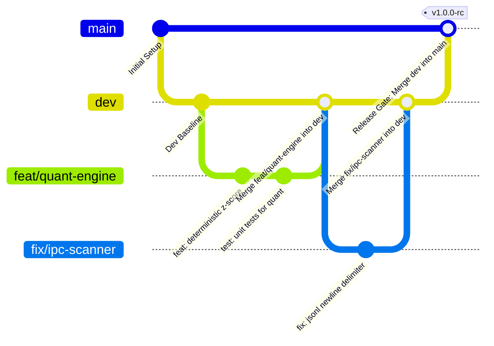

# 09 — Alur Kerja Git & Strategi Proteksi Cabang (Git Workflow & Branch Protection)

**Status:** ACCEPTED  
**Versi Dokumen:** 1.0.0  
**Terakhir Diperbarui:** 2026-09-18  
**Kepatuhan Terkait:** [`AGENTS.md`](../../AGENTS.md), [`07-non-functional-requirements.md`](07-non-functional-requirements.md)

Dokumen ini mendefinisikan standar alur kerja Git (*Git Workflow*), konvensi cabang (*branch taxonomy*), dan mekanisme perlindungan cabang (*branch protection*) untuk memastikan integritas, stabilitas, dan keamanan kode pada repositori **Niskava Agent**.

---

## 1. Prinsip Utama & Filosofi Branching

1. **`main` Adalah Sumber Kebenaran Produksi (Production Source of Truth)**:
   - Cabang `main` hanya memuat kode yang stabil, telah teruji menyeluruh, dan siap dinilai untuk penjurian kompetisi (*competition submission ready*).
   - **Dilarang keras melakukan direct push ke `main`**.
2. **`dev` Sebagai Wadah Integrasi & Pengujian (Integration & Staging Hub)**:
   - Cabang `dev` berfungsi sebagai cabang integrasi utama tempat seluruh fitur, perbaikan bug, dan pembaruan arsitektur disatukan sebelum masuk ke `main`.
   - Menjamin bahwa seluruh komponen poliglut (Go Core, Python Engine, React Web) dapat berinteraksi secara harmonis tanpa merusak lingkungan produksi.
3. **Isolasi Fitur Berbasis Cabang Pendek (Short-Lived Feature Branches)**:
   - Setiap pengerjaan fitur baru, bugfix, atau dokumen wajib dikerjakan di cabang terisolasi yang dibuat dari cabang `dev`.

---

## 2. Taksonomi Cabang (*Branch Taxonomy*)

| Cabang | Tipe | Sumber Basis (*Branch From*) | Target Penggabungan (*Merge Into*) | Deskripsi & Hak Akses |
|---|---|---|---|---|
| **`main`** | Permanen | - | - | **Production / Final Release**. Dilindungi secara ketat (*Strictly Protected*). Hanya menerima penggabungan dari `dev` melalui Pull Request / Release Gate. |
| **`dev`** | Permanen | `main` | `main` | **Integration & Staging**. Dilindungi (*Protected*). Menerima penggabungan dari cabang-cabang fitur/perbaikan setelah lolos uji lokal dan review. |
| **`feat/*`** | Temporer | `dev` | `dev` | **Fitur Baru**. Digunakan untuk pengembangan fitur tertentu (contoh: `feat/quant-anomaly`, `feat/sectors-cache`). Dihapus setelah digabungkan. |
| **`fix/*`** | Temporer | `dev` | `dev` | **Perbaikan Bug**. Digunakan untuk perbaikan galat atau masalah teknis (contoh: `fix/sqlite-wal-locking`, `fix/sse-reconnect`). Dihapus setelah digabungkan. |
| **`docs/*`** | Temporer | `dev` | `dev` | **Dokumentasi**. Digunakan untuk penambahan atau revisi spesifikasi arsitektur dan panduan (contoh: `docs/git-workflow`). |
| **`hotfix/*`** | Temporer | `main` | `main` & `dev` | **Perbaikan Darurat**. Khusus perbaikan kritis darurat pada rilis `main`. Wajib di-merge ke `main` dan di-backport ke `dev`. |

---

## 3. Diagram Alur Siklus Hidup Git



---

## 4. Prosedur Operasional Standar (SOP) Langkah-demi-Langkah

### Tahap 1: Memulai Pengerjaan Tugas Baru
Selalu sinkronkan cabang `dev` lokal dengan remote sebelum membuat cabang baru:
```bash
# 1. Beralih ke cabang dev
git checkout dev

# 2. Tarik pembaruan terkini
git pull origin dev

# 3. Buat cabang baru sesuai taksonomi
git checkout -b feat/nama-fitur-baru
# atau: git checkout -b fix/nama-perbaikan
# atau: git checkout -b docs/nama-dokumen
```

### Tahap 2: Pengembangan & Commit Lokal
Gunakan format **Conventional Commits**:
* `feat(scope): deskripsi` — Penambahan fungsionalitas baru.
* `fix(scope): deskripsi` — Perbaikan bug.
* `docs(scope): deskripsi` — Penulisan atau perbaikan dokumentasi.
* `test(scope): deskripsi` — Penambahan atau pembaruan unit test.
* `refactor(scope): deskripsi` — Restrukturisasi kode tanpa mengubah fungsionalitas.
* `chore(scope): deskripsi` — Pembaruan konfigurasi build, dependensi, perkakas.

Contoh:
```bash
git add .
git commit -m "feat(quant): implement deterministic volume z-score formula"
```

### Tahap 3: Verifikasi Pra-Penggabungan ke `dev`
Sebelum menggabungkan ke `dev`, seluruh verifikasi lokal berikut wajib lolos:
1. **Pemeriksaan Kompilasi & Linter Go**:
   ```bash
   go vet ./...
   go build ./cmd/niskava
   ```
2. **Pemeriksaan Modul Python**:
   ```bash
   python3 -m py_compile engine/*.py engine/*/*.py
   pytest engine/
   ```
3. **Pemeriksaan Build Frontend**:
   ```bash
   cd web && npm run build && cd ..
   ```
4. **Pembersihan Rahasia (Secrets Scrubbing)**:
   Pastikan tidak ada kunci API (`sec_live_...` atau `AIza...`) yang masuk ke dalam berkas yang di-commit.

### Tahap 4: Penggabungan ke Cabang `dev`
Unggah cabang kerja ke remote dan lakukan merge ke `dev`:
```bash
# 1. Push cabang kerja ke remote
git push origin feat/nama-fitur-baru

# 2. Sinkronkan dan gabungkan ke dev
git checkout dev
git pull origin dev
git merge --no-ff feat/nama-fitur-baru -m "merge: feat/nama-fitur-baru into dev"
git push origin dev

# 3. Hapus cabang kerja lokal yang sudah selesai
git branch -d feat/nama-fitur-baru
```

### Tahap 5: Rilis & Penggabungan dari `dev` ke `main` (Release Gate)
Penggabungan dari `dev` ke `main` hanya dilakukan ketika sekumpulan fitur telah rampung dan terbukti stabil di `dev`:
1. Pastikan seluruh *Quality Gate Checklist* terpenuhi.
2. Lakukan penggabungan dengan fast-forward atau merge commit terverifikasi:
   ```bash
   git checkout main
   git pull origin main
   git merge --no-ff dev -m "release: merge dev into main [version/milestone]"
   git push origin main
   ```
3. Berikan tag versi rilis (opsional, jika mencapai milestone tertentu):
   ```bash
   git tag -a v0.1.0 -m "Release v0.1.0 milestone"
   git push origin v0.1.0
   ```

---

## 5. Konfigurasi Aturan Proteksi Cabang (*Branch Protection Rules*)

Pada platform hosting git (GitHub), branch protection wajib diaktifkan dengan ketentuan:

### A. Proteksi untuk Cabang `main` (Strict Level):
* **Require a pull request before merging**: Aktif (minimal 1 review persetujuan).
* **Require status checks to pass before merging**: Aktif (CI build dan automated test harus lolos).
* **Do not allow bypassing the above settings**: Berlaku untuk seluruh kontributor dan administrator.
* **Restrict who can push to matching branches**: Nonaktifkan direct push ke `main`.

### B. Proteksi untuk Cabang `dev` (Moderate Level):
* **Require status checks to pass before merging**: Aktif (CI build).
* **Block force pushes**: Cegah `git push --force` untuk melindungi riwayat komit integrasi tim.
* **Block deletions**: Cegah penghapusan cabang `dev` secara tidak sengaja.

---

## 6. Check-List Quality Gate Pra-Merge ke `main`

Sebelum merge `dev -> main` dieksekusi, periksa daftar checklist berikut:

- [ ] **Kompilasi Sukses**: `go build ./cmd/niskava` berhasil tanpa galat kompilasi.
- [ ] **Pengujian Unit Lolos**: `go test ./...` dan pengujian unit Python `pytest` berjalan 100% hijau.
- [ ] **Kepatuhan Invarian (6 Laws)**:
  - [ ] Law 1: Kalkulasi kuantitatif dilakukan deterministik sebelum LLM.
  - [ ] Law 2: Tidak ada rekomendasi beli/jual (*non-advisory boundary* terpenuhi).
  - [ ] Law 3: Tidak ada API eksekusi order broker (*read-only intelligence*).
  - [ ] Law 4: Database SQLite lokal menggunakan WAL mode.
  - [ ] Law 5: Caching `sectors_cache` aktif, hemat kredit API.
  - [ ] Law 6: Graf memori percakapan beroperasi lokal.
- [ ] **Zero Hardcoded Secrets (Law 7)**: Tidak ada API Key yang tersimpan di dalam berkas kode atau konfigurasi git.
- [ ] **Clean Working Directory**: Tidak ada sisa berkas temporer atau dependensi lokal yang bocor ke git.
