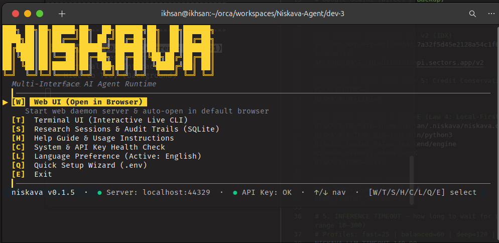
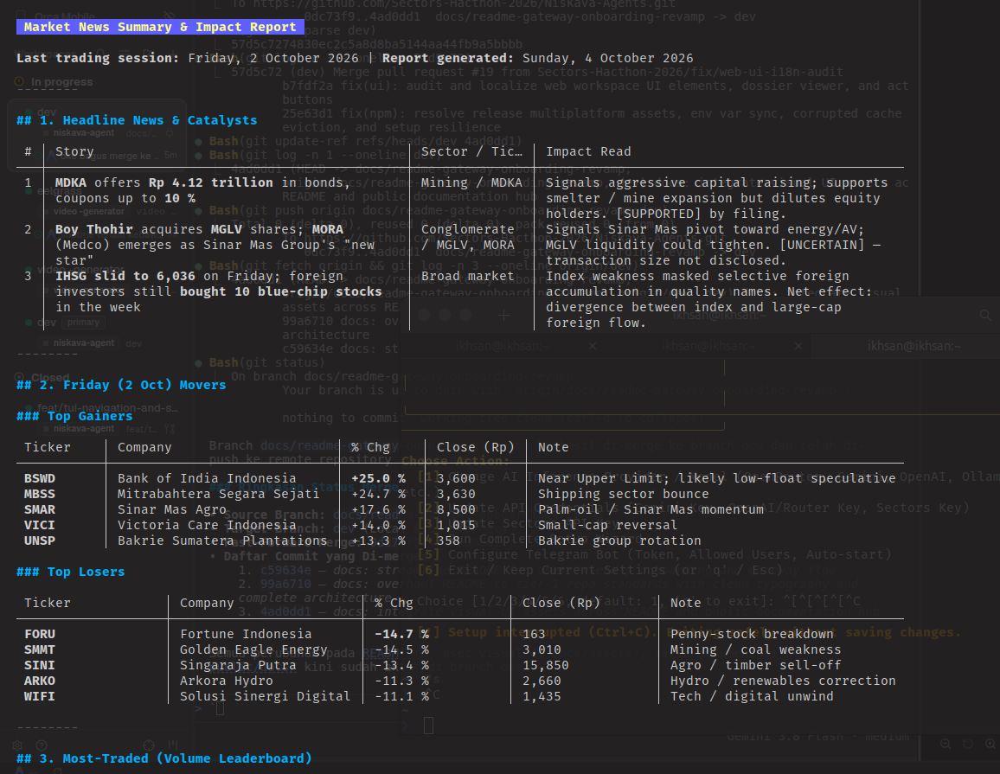
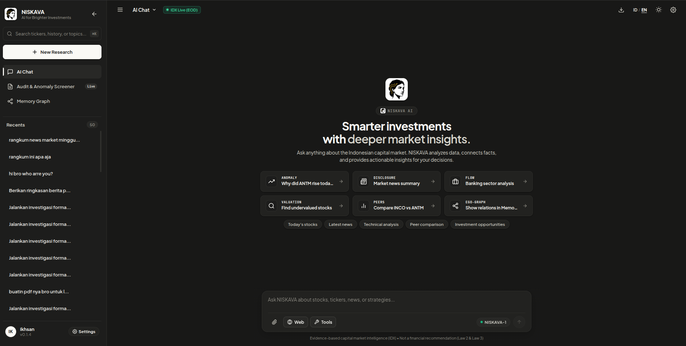
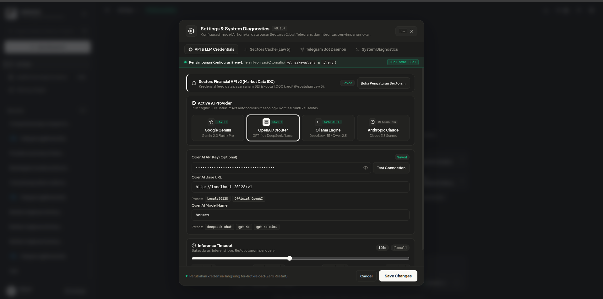
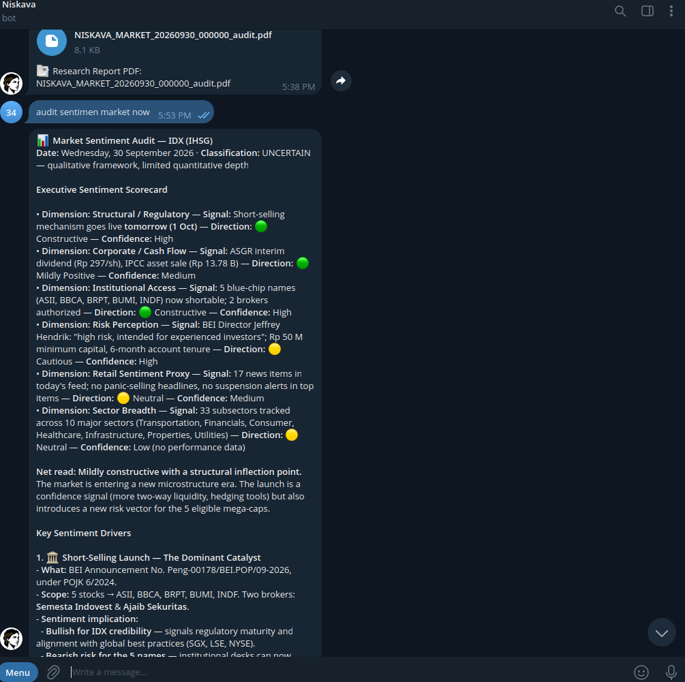
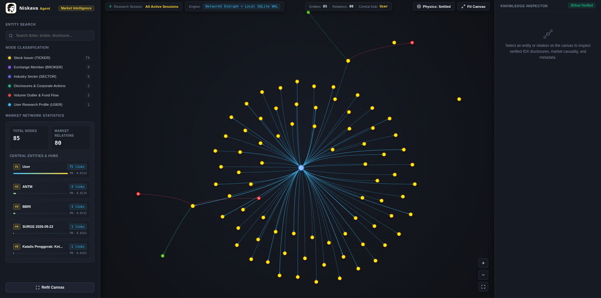

# User Guide & Interface Manual

Niskava Agent provides multiple interaction surfaces suited for ad-hoc terminal research, browser-based visual investigation, automated CLI scripting, and external agent integrations.

---

## Overview of Interaction Surfaces

```
┌───────────────────────────────────────────────────────────────────┐
│                    NISKAVA INTERACTION SURFACES                   │
├───────────────────────────────────────────────────────────────────┤
│ 1. Terminal UI (TUI) REPL & HUD Launcher                          │
│    Command : `niskava` or `niskava terminal`                      │
│    Use Case: Interactive prompt-driven research, slash commands.  │
│                                                                   │
│ 2. Autonomous Headless Pipeline CLI                               │
│    Command : `niskava investigate <TICKER> --days 30`             │
│    Use Case: Scripted, non-interactive execution & audit trails.  │
│                                                                   │
│ 3. Web Workspace (Browser Visual Terminal)                        │
│    Command : `niskava serve --port 20128 --open`                  │
│    Use Case: Candlestick charting, SSE stream, evidence matrices. │
│                                                                   │
│ 4. Session History & Management                                   │
│    Command : `niskava sessions`                                   │
│    Use Case: Reviewing past investigations and resuming chats.    │
│                                                                   │
│ 5. Interactive Knowledge Graph Visualization                     │
│    Command : `niskava graph --open`                               │
│    Use Case: Visualizing associative memory graphs in browser.    │
│                                                                   │
│ 6. Model Context Protocol (MCP) Server                            │
│    Command : `niskava mcp`                                        │
│    Use Case: Connecting Niskava to Claude Desktop, Cursor, etc.   │
│                                                                   │
│ 7. Telegram Bot Runner                                            │
│    Command : `niskava telegram`                                   │
│    Use Case: Mobile market alerts and conversational queries.     │
└───────────────────────────────────────────────────────────────────┘
```

---

## 1. Terminal UI (TUI) HUD Launcher

Running `niskava` without arguments starts the interactive Terminal UI launcher:

```bash
niskava
```

<p align="center">
  
</p>

The launcher displays application health status, configured API keys, and a keyboard-driven menu:

* **`[T]` Terminal UI (Interactive Live CLI)**: Launches the natural language REPL.
* **`[W]` Web Workspace (Serve React UI)**: Starts the background daemon and opens your default browser at `http://localhost:20128`.
* **`[S]` Saved Sessions & History**: Browse, search, pin, and resume previous research sessions.
* **`[H]` Health & Diagnostics**: Displays SQLite WAL status, Python environment paths, and provider connectivity.
* **`[L]` Language Selector**: Toggle between Indonesian (`id`) and English (`en`).
* **`[U]` Setup Wizard**: Re-run the interactive credential setup wizard.
* **`[?]` Help & Commands Guide**: Complete overview of terminal hotkeys and slash commands.
* **`[Q]` Exit Niskava**: Cleanly terminates background processes and returns to shell.

---

## 2. Interactive Terminal REPL

The interactive REPL provides a natural language conversational research environment with streaming Glamour markdown rendering.

```bash
niskava terminal    # or: niskava repl / niskava chat
```

<p align="center">
  
</p>

### Prompt History Navigation
* Press **Up Arrow (↑)** to recall previous queries.
* Press **Down Arrow (↓)** to navigate forward through newer queries.

### Real-Time Braille Progress Indicator
During quantitative math execution, Sectors API queries, and disclosure harvesting, an animated Braille spinner displays live phase transitions:
```text
⠋ [gemini-2.0-flash] Running market anomaly reconnaissance on ANTM...
```

### Natural Language Research Queries
Ask questions in plain Indonesian or English:
* *"Cek anomali transaksi saham BBCA 30 hari terakhir."*
* *"Mengapa saham ANTM melonjak kemarin? Cek keterbukaan informasi IDX."*
* *"Bandingkan valuasi perbankan big-4 (BBCA, BBRI, BMRI, BBNI) dengan Altman Z-Score."*
* *"Apakah foreign flow saham ASII searah dengan IHSG minggu ini?"*

### Autocomplete Slash Commands
Type `/` in the prompt input to open the interactive autocomplete popup:

| Command | Category | Description | Example |
|---|---|---|---|
| `/help` | `[SYSTEM]` | Displays available keyboard shortcuts and slash commands. | `/help` |
| `/chats` | `[NAV]` | Opens interactive session selector (Pin `Ctrl+P`, Delete `Ctrl+D`, Export `Ctrl+E`). | `/chats` |
| `/model` | `[CONFIG]` | Switch AI model or provider on the fly. | `/model gemini-1.5-pro` |
| `/config` | `[CONFIG]` | Displays active runtime configuration and credentials. | `/config` |
| `/setup` | `[CONFIG]` | Re-launches the interactive setup wizard. | `/setup` |
| `/timeout` | `[CONFIG]` | Adjust inference timeout profile (`fast`, `balanced`, `deep`, `local`). | `/timeout balanced` |
| `/compact` | `[NAV]` | Toggles compact mode (hides raw tool thought logs). | `/compact` |
| `/find <kw>` | `[INTEL]` | Quick search past chat sessions by ticker or keyword. | `/find BBCA` |
| `/copy` | `[NAV]` | Copies latest assistant response directly to OS clipboard. | `/copy` |
| `/resume <ID>` | `[INTEL]` | Resumes a specific chat session by its ID. | `/resume CHAT-20261002-6636` |
| `/export [fmt]` | `[INTEL]` | Exports current session transcript to `md` (default), `json`, or `txt`. | `/export md` |
| `/fork [title]` | `[NAV]` | Forks current research session into a new branch. | `/fork Bullish Scenario` |
| `/doctor` | `[SYSTEM]` | Runs instant system health diagnostics. | `/doctor` |
| `/graph` | `[NAV]` | Exports and opens associative knowledge graph in browser. | `/graph` |
| `/web` | `[NAV]` | Starts and opens the local Web Workspace. | `/web` |
| `/clear` | `[SYSTEM]` | Clears the terminal screen buffer. | `/clear` |
| `/exit` | `[SYSTEM]` | Exits the REPL session. | `/exit` |

---

## 3. Autonomous Headless Investigation CLI

Run a single-command structured investigation pipeline on any IDX ticker:

```bash
# Run 30-day investigation on ANTM:
niskava investigate ANTM --days 30

# Export formal institutional PDF report:
niskava investigate ANTM --days 30 --pdf

# Run in English:
niskava investigate BBCA --days 30 --lang en
```

### CLI Flags:
* `-i, --interactive`: Launches an interactive REPL session pre-seeded with the target ticker post-investigation.
* `--days <N>`: Historical trading days to analyze (default: 30).
* `--pdf`: Compiles and saves an institutional PDF research dossier to `~/.niskava/reports/`.
* `--lang <en|id>`: Output language (`id` for Indonesian, `en` for English).
* `--offline`: Runs in offline mode using local fixtures without making network requests.
* `-v, --verbose`: Prints detailed debug logs and IPC payload messages.

---

## 4. Local Web Workspace Canvas

Launch the high-throughput local REST/SSE server and interactive visual workspace:

```bash
niskava serve --port 20128 --open
```

<p align="center">
  
</p>

### Key Workspace Features:
* **Interactive Candlestick Chart:** Powered by TradingView lightweight charts with Volume Z-Score badges ($V_z \ge 2.5\sigma$) and breakout tags ($|R_t| \ge 5\%$).
* **Real-Time Thinking Stream:** Server-Sent Events (SSE) stream agent reasoning, tool calls, and observations live.
* **Interactive Evidence Matrix:** Filter findings by status (`SUPPORTED`, `UNCERTAIN`, `CONTRADICTED`) and confidence level.
* **Chronological Timeline Graph:** Visual representation of corporate events relative to trading volume spikes.
* **Settings & Diagnostics Hub:** Dynamic provider switching, timeout sliders, cache flush, and Telegram whitelist configuration directly in the browser:

<p align="center">
  
</p>

---

## 5. Model Context Protocol (MCP) Server

Integrate Niskava tools natively into external AI agents:

```bash
niskava mcp
```

### Claude Desktop Configuration (`claude_desktop_config.json`):
* **macOS:** `~/Library/Application Support/Claude/claude_desktop_config.json`
* **Windows:** `%APPDATA%\Claude\claude_desktop_config.json`

```json
{
  "mcpServers": {
    "niskava": {
      "command": "niskava",
      "args": ["mcp"]
    }
  }
}
```

Once configured, Claude can invoke Niskava tools natively:
* `get_daily_candles`
* `compute_quant_anomalies`
* `harvest_market_news`
* `query_sectors`
* `execute_skill`
* `recall_graph_memory`

---

## 6. Telegram Bot Runner

Deploy Niskava as your autonomous market intelligence assistant directly on Telegram. Incoming inquiries trigger the autonomous ReAct investigation pipeline with live typing indicators, local SQLite persistence, and PDF/Markdown report export.

<p align="center">
  
</p>

### 6.1 Setup & Configuration

You can configure the Telegram Bot via any of three convenient methods:

#### Method A: Interactive Setup Wizard (Recommended)
Run the built-in wizard and select Step 6:
```bash
niskava setup
```
The wizard prompts for your bot token from [@BotFather](https://t.me/botfather), performs a live API connection verification ping, configures user whitelists, and saves settings to `~/.niskava/config.yaml` and `.env`.

#### Method B: Web Workspace Settings
Open the Web Workspace at `http://localhost:20128` (or your configured port), navigate to **Settings** modal, and open the **Telegram Bot Daemon** tab. You can configure credentials, manage user whitelist chips, start/stop the bot, and send ping test messages.

#### Method C: Environment Variables (`.env`)
Configure credentials in `~/.niskava/.env` or project `.env`:
```ini
# Primary configuration (Single Source of Truth)
NISKAVA_TELEGRAM_TOKEN="123456789:ABCdefGhI..."
NISKAVA_TELEGRAM_ENABLED=1
NISKAVA_TELEGRAM_ALLOWED_USERS="YourTelegramUsername,12345678"

# Note: Fallback aliases (TELEGRAM_BOT_TOKEN, TELEGRAM_ENABLED, TELEGRAM_ALLOWED_USERS) are also supported.
```

---

### 6.2 CLI Subcommands & Diagnostics

Niskava provides a dedicated suite of CLI commands under `niskava telegram` (alias: `niskava bot`):

#### 1. Start the Bot Worker
```bash
# Start bot using configuration from config.yaml / .env
niskava telegram

# Override token explicitly on the command line
niskava telegram --token "123456789:ABCdefGhI..."
```

#### 2. Check Bot Status & Identity (`status`)
Verifies live connectivity against Telegram API (`getMe`), checks bot username, autostart status, and active whitelist:
```bash
niskava telegram status
```

#### 3. Manage Authorized Users Whitelist (`user`)
Prevent unauthorized API credit consumption by restricting access to specified Telegram usernames or numeric User IDs:
```bash
# List all whitelisted users
niskava telegram user list

# Add authorized username or numeric ID (automatically saves to config.yaml & .env)
niskava telegram user add YourTelegramUsername
niskava telegram user add 987654321

# Remove a user from the whitelist
niskava telegram user remove YourTelegramUsername
```
> **Tip:** To find your numeric Telegram User ID, send `/start` to `@userinfobot` or `@RawDataBot` on Telegram.

#### 4. Send Verification Test Message (`test`)
Send a direct test ping to verify message delivery to a specific chat:
```bash
niskava telegram test --chat-id 987654321
niskava telegram test --chat-id 987654321 --message "Ping from Niskava Agent terminal"
```

#### 5. Background Daemon Mode
To run the Telegram bot concurrently in the background alongside the Web Workspace and REST API:
```bash
# Run server with telegram daemon flag
niskava serve --telegram

# Or set NISKAVA_TELEGRAM_ENABLED=1 in .env
```

---

### 6.3 Bot Commands & Interactions

When interacting with the bot in Telegram:

#### System Commands:
* `/start` or `/help` — Overview of capabilities, active configuration, and command list.
* `/new` or `/reset` — Archive current chat history and initialize a fresh research session.
* `/status` — View current session activity (`Idle` / `Processing`), AI model provider, active market, and offline state.
* `/export` — Download the current session investigation transcript as a formatted Markdown research report (`.md`).
* `/stop` — Abort currently executing background investigation.

#### Conversational Inquiries & Tickers:
* **Direct Equity Tickers:** Send any IDX ticker symbol directly (e.g., `ANTM`, `BBRI`, `BBCA`) to initiate automated reconnaissance.
* **Natural Language Prompts:** Ask complex empirical market questions, e.g.:
  - *"Investigate abnormal volume and foreign flow for BMRI over the last 30 days"*
  - *"Check recent IDX disclosures and news catalysts for PGAS"*
  - *"Run financial health stress test on ASII"*
* All responses strictly adhere to **Law 2 (Financial Non-Advisory Boundary)** with discrete confidence scores and regulatory disclaimers.

---

## 7. Interactive Knowledge Graph & Memory Visualizer (`niskava graph`)

Niskava maintains associative cross-session memory by converting market discoveries and user inquiries into an interconnected entity graph. Rather than suffering from session amnesia or sending sensitive research histories to cloud databases, all knowledge nodes and directed relationships are stored locally in SQLite (`~/.niskava/niskava.db`) and analyzed using NetworkX in Python.

<p align="center">
  
</p>

### 7.1 Key Visualizer Features

* **Force-Directed Physics Layout:** Real-time physics simulation organizes entities into intuitive topological clusters with zoom, pan, and canvas centering.
* **Color-Coded Node Classification:**
  - **Stock Issuer (`TICKER`, yellow):** IDX-listed companies (e.g., `ANTM`, `BBRI`).
  - **Exchange Member (`BROKER`, purple):** Securities brokerages tracked during bandarmology forensic audits.
  - **Industry Sector (`SECTOR`, cyan):** Official IDX industry sector classifications (e.g., `Basic Materials`, `Financials`).
  - **Disclosures & Corporate Actions (`CATALYST_EVENT`, green):** Formal regulatory announcements, dividend schedules, and verified news stories.
  - **Volume Outlier & Fund Flow (`VOLUME_OUTLIER`, red):** Statistically significant volume spikes ($V_z \ge 2.5\sigma$) and foreign flow accumulation streaks.
  - **User Research Profile (`USER`, light blue):** Central hub node anchoring user-initiated investigations, watchlists, and entry price points.
* **Central Entities & Hubs Analysis:** Calculates PageRank and degree connectivity scores to highlight dominant market hubs linking multiple tickers or sectors.
* **Knowledge Inspector:** Selecting any entity or directed relation on the canvas displays verified IDXnet disclosures, chronological timestamps, source links, and raw indicator metadata.
* **Entity Search:** Real-time search filter allowing instant lookup across tickers, brokers, or corporate actions.

---

### 7.2 CLI Commands & Options

Niskava provides the dedicated `niskava graph` command for inspecting, exporting, and managing knowledge graph state:

```bash
# Export knowledge graph to HTML and open in default browser:
niskava graph --open

# Focus graph around a specific equity symbol with a 2-hop radius:
niskava graph --ticker ANTM --depth 2 --open

# Filter graph entities discovered during a specific session:
niskava graph --session INV-20261002-6636 --open

# Render text summary table of nodes, edges, and central hubs in console:
niskava graph --text

# Clean evaluation and test benchmark data (EVAL-*) from local storage:
niskava graph --prune

# Specify custom HTML export file destination:
niskava graph -o ~/Desktop/antm_market_graph.html
```

#### CLI Flags:
* `-o, --output <path>`: Destination path for HTML export file (default: `~/.niskava/graph.html`).
* `-t, --ticker <SYMBOL>`: Center ego-network graph around a specific equity symbol.
* `-d, --depth <1|2>`: Neighbor radius depth for ego-network extraction (default: 1).
* `-s, --session <ID>`: Filter graph records by investigation session ID.
* `--text`: Print structured tabular statistics directly in terminal without launching a browser.
* `--prune`: Purge temporary benchmark and evaluation data (`EVAL-*`) from SQLite.
* `--open`: Automatically launch the exported HTML file in your default browser (default: true).

---

### 7.3 Multi-Surface Integration

* **Terminal UI REPL:** Enter `/graph` at any prompt during a research session to render and open the active knowledge graph in your browser.
* **Web Workspace:** Access the interactive graph directly via the `/graph` route in your browser dashboard (`http://localhost:20128/graph`).
* **MCP Integration:** External agent orchestrators can query graph context using the native `recall_graph_memory` MCP tool.

